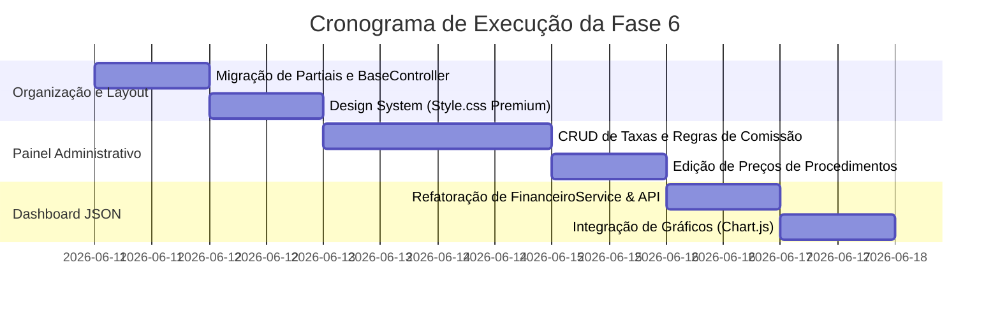

# Planejamento Consolidado — Fase 6: Interface e Painel Administrativo

Este documento apresenta o escopo detalhado, a arquitetura e o plano de ação para a **Fase 6**, a etapa final para a homologação do sistema. O objetivo é unificar a apresentação visual do software a um padrão premium de mercado (SaaS) e disponibilizar ao administrador da clínica o controle total sobre as regras financeiras do negócio (taxas de cartão, comissões de profissionais e preços de procedimentos) diretamente pela interface.

---

## 1. Escopo Funcional da Fase 6

Baseado nas exigências do [Trabalho Final.pdf](file:///home/rafael/Documents/projetointegrado2_turma2023/contextopdf/Trabalho Final.pdf), a Fase 6 será dividida em três pilares principais:

### Pilar A: Painel Administrativo de Parâmetros Flexíveis (CRUD de Regras)
O controle de taxas e regras sairá definitivamente do código-fonte para a interface.

1. **Gestão de Taxas de Maquininha (`clinica_taxas_cartao`):**
   * Tela para listar e editar as taxas de juros por bandeira de cartão (Visa, Master, Elo, etc.) e modalidade (crédito/débito).
   * Suporte a parcelamentos de 1x a 12x.
2. **Gestão de Regras de Comissão (`clinica_regras_comissao` e `clinica_configuracoes`):**
   * Formulário para alterar a meta de faturamento mensal e os percentuais de repasse (base e bônus) dos dentistas.
   * Campos para atualizar as taxas específicas de procedimentos especializados (ex: Prótese, Canal e Cirurgias).
3. **Gestão de Dados da Clínica:**
   * Tela para atualizar os dados institucionais (Nome Fantasia, CNPJ, Endereço e Telefone) que alimentam o [recibo.php](file:///home/rafael/Documents/projetointegrado2_turma2023/app/Views/atendimentos/recibo.php) dinamicamente.
4. **Edição de Preços de Procedimentos (Impacto Futuro):**
   * Implementação da funcionalidade de edição de procedimentos no [ProcedimentoController.php](file:///home/rafael/Documents/projetointegrado2_turma2023/app/Controllers/ProcedimentoController.php).
   * Garantia de que a alteração de preço modifique apenas o `valor_base` de atendimentos futuros, mantendo a tabela `atendimento_procedimentos` intocada para relatórios passados (regra de imutabilidade histórica).

### Pilar B: Dashboard Interativo (AJAX + Chart.js)
Eliminar qualquer lógica de banco no controlador e alimentar a interface assincronamente.

1. **Centralização no `FinanceiroService`:**
   * O [DashboardController](file:///home/rafael/Documents/projetointegrado2_turma2023/app/Controllers/DashboardController.php) deixará de interagir diretamente com os Models de `Atendimento` e `Despesa`.
   * Toda a agregação de dados do dashboard será delegada ao [FinanceiroService](file:///home/rafael/Documents/projetointegrado2_turma2023/app/Services/FinanceiroService.php).
2. **Consumo de Estatísticas via JSON (API):**
   * Criação do endpoint `/dashboard/api-stats` que retornará dados de faturamento, despesas e faturamento líquido formatados em JSON.
3. **Gráficos com Chart.js:**
   * Renderização dinâmica de dois gráficos principais:
     - **Evolução Mensal:** Gráfico de linha/barras comparativo (Receitas x Despesas).
     - **Distribuição de Pagamentos:** Gráfico de pizza/rosca com as formas de pagamento (Pix, Dinheiro, Cartão de Crédito/Débito).

### Pilar C: Design System Premium & Partials (Rich Aesthetics)
Elevar a qualidade visual do produto final.

1. **Inclusão Dinâmica de Partials:**
   * Centralizar `header.php` e `footer.php` no diretório MVC em `app/Views/partials/`.
   * Refatorar o [BaseController](file:///home/rafael/Documents/projetointegrado2_turma2023/app/Controllers/BaseController.php) para gerenciar o carregamento de forma limpa.
2. **Estilização Premium (Style.css):**
   * Aplicação de paleta HSL consistente (Azul Royal, Verde Esmeralda, Vermelho Carmim).
   * Efeitos de Glassmorphism (transparências elegantes em modais e headers).
   * Micro-animações em botões, tabelas e links (transição suave de escala e cores).

---

## 2. Arquitetura de Classes e Views

### Novos Componentes a Criar:

* **Controller:** `App\Controllers\ClinicaController`
  * Responsável por gerenciar as rotas de exibição do painel de controle e a gravação de taxas e regras da clínica no banco de dados.
* **Views:**
  * `app/Views/clinica/painel.php`: Painel centralizador administrativo.
  * `app/Views/clinica/editar_taxas.php`: Formulário para definir as taxas de cartão de 1x a 12x.
  * `app/Views/procedimentos/editar.php`: Formulário para alteração de preço do procedimento.
  * `app/Views/partials/alert.php`: Banner padronizado de feedback (sucesso/erro).

---

## 3. Cronograma de Ações e Validação

### Critérios de Aceitação e Testes:
* **Taxas Dinâmicas:** Alterar a taxa de parcelamento do cartão de crédito de 1x de `3.0%` para `1.5%` no painel administrativo e validar que o lucro líquido de um novo atendimento teste reflete imediatamente a nova taxa calculada.
* **Imutabilidade Histórica:** Alterar o preço de uma "Limpeza" de `R$ 80,00` para `R$ 120,00` e validar que os atendimentos passados no dashboard e no relatório por paciente permanecem com o valor antigo de `R$ 80,00`.
* **Zero Queries no Dashboard:** Garantir que o [DashboardController](file:///home/rafael/Documents/projetointegrado2_turma2023/app/Controllers/DashboardController.php) não faça chamadas SQL diretas e sirva os dados estritamente via JSON de API e DTOs fornecidos pelo `FinanceiroService`.
